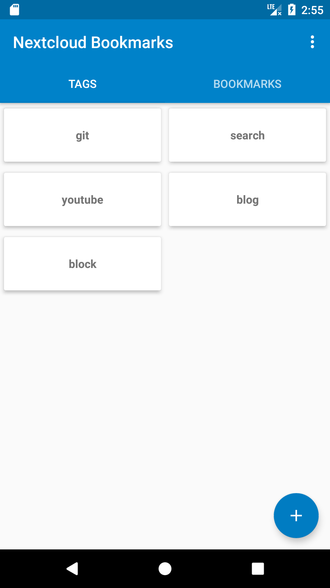
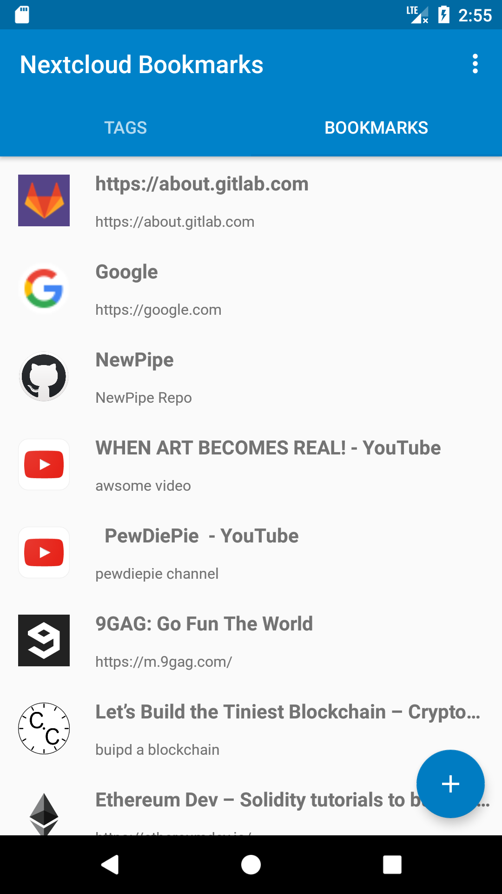
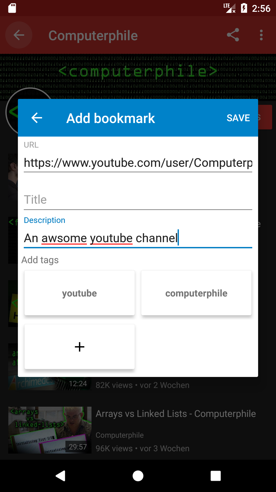
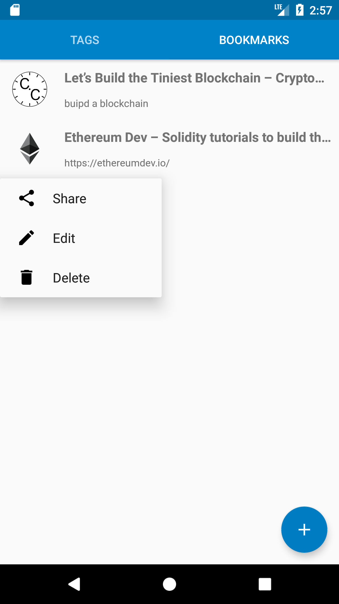

Owncloud/Nextcloud Bookmarks Android App
========================================

An Android front end for the Nextcloud/Owncloud [Bookmark App](https://github.com/nextcloud/bookmarks/) 
based on the new [REST API](https://github.com/nextcloud/bookmarks/#rest-api) that was introduced
by Bookmarks version [0.10.1](https://github.com/nextcloud/bookmarks/releases/tag/v0.10.1)

*ATTENTION*: The app is only available for Nextcloud so far, because v0.10.1 of Bookmakrs is only available
for Nextcloud so far. As soon as this version is available for ownCloud, there will also be an ownCloud version
of the app.

[">](assets/nx/screenshots/shot1.png)
[">](assets/nx/screenshots/shot2.png)
[">](assets/nx/screenshots/shot3.png)
[">](assets/nx/screenshots/shot4.png)
[">](assets/nx/screenshots/shot5.png)

